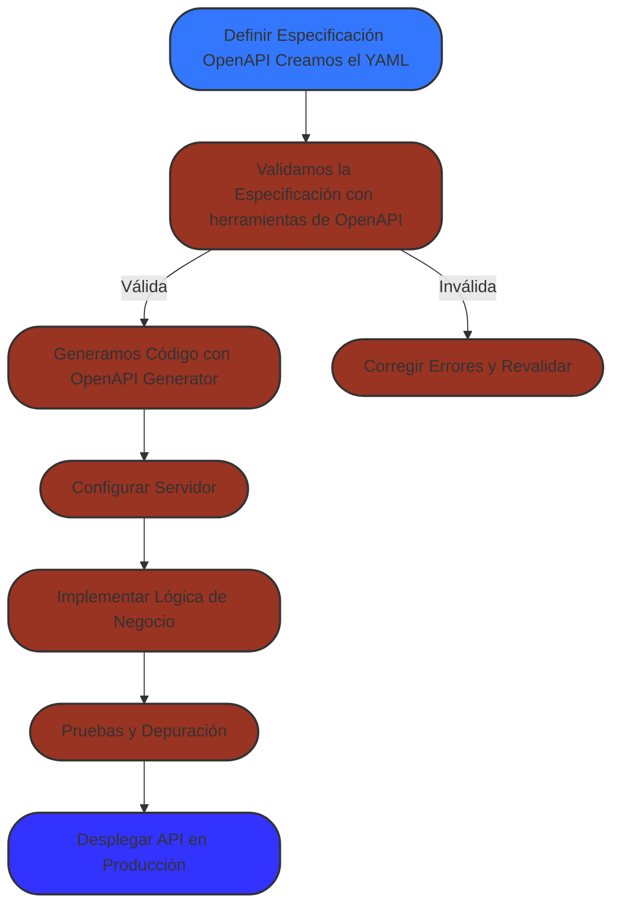

# Diseño de APIs


## Qué son las APIs?

API es el acronimo de API `application programming interface` que traducido al español es `interfaz de programación de aplicaciones` es código  que permite a dos aplicaciones comunicarse entre sí para compartir información y funcionalidades. 

## Guías para escribir APIs

Hay muchas guías para escribir REST APIs, nosotros nos basaremos en las guías de Google [https://google.aip.dev/general](https://google.aip.dev/general).


## Como creamos APIs?

Hay muchas manerass de crear APIs, lo usual es que durante el desarrollo de proyectos pequeños usemos un framework, y conforme se vaya necesitando vamos agregando endpoints, con sus respectivas logicas. 
Sin embargo cuando trabajos en sistemas que estan escalados esto se convierte en una mala practica de desarollo que es muy dificil de mantener. 
Por lo cual, han surgido varias alternatrivas que tratan de centralizar el desarrollo alrededor de las APIs.

Vamos a explorar una de las maneras más eficaces usando Swagger, OpenAPI y TypeSpec.

- [Swagger]()
- [OpenAPI](https://swagger.io/specification/)
- [typespec](https://typespec.io/)


## OpenAPI

OpenAPI es una especificación estándar para describir, documentar y consumir REST APIs de manera estructurada, se supone que es legible para maquinas y para humanos, sin embargo, es muy verboso este estandar lo cual complica su legibilidad para humanos. 


Antes era  el famoso **Swagger**, pero desde la versión 3.0 se llama OpenAPI Specification (OAS).

### ¿Qué  beneficios trae OpenAPI?

- **Documentar APIs** : Define los endpoints, métodos HTTP, parámetros, respuestas y errores de una API de una manera estructurada y "legible".
- **Permite generar código automáticamente** : Con OpenAPI definimos archivos (`.yaml` o `.json`), y de ellos podemos generar clientes, servidores y SDKs en distintos lenguajes como [openapi-generator](https://github.com/OpenAPITools/openapi-generator).
- **Explorar APIs con Swagger UI**: La pricipal razon de **Swagger UI** es visualizar y probar los endpoints de la API de forma interactiva.
- **Estandar**: Es un estandar de la industria.

### ¿Cómo escribimos OpenAPI?

El archivo se escribe en **YAML** o **JSON**. Por ejemplo:

```yaml
openapi: 3.0.0
info:
  title: Mi API
  version: 1.0.0
paths:
  /usuarios:
    get:
      summary: Obtiene la lista de usuarios
      responses:
        '200':
          description: Lista de usuarios
          content:
            application/json:
              schema:
                type: array
                items:
                  type: string
```





## References


- [HTTP Status](https://www.iana.org/assignments/http-status-codes/http-status-codes.xhtml)