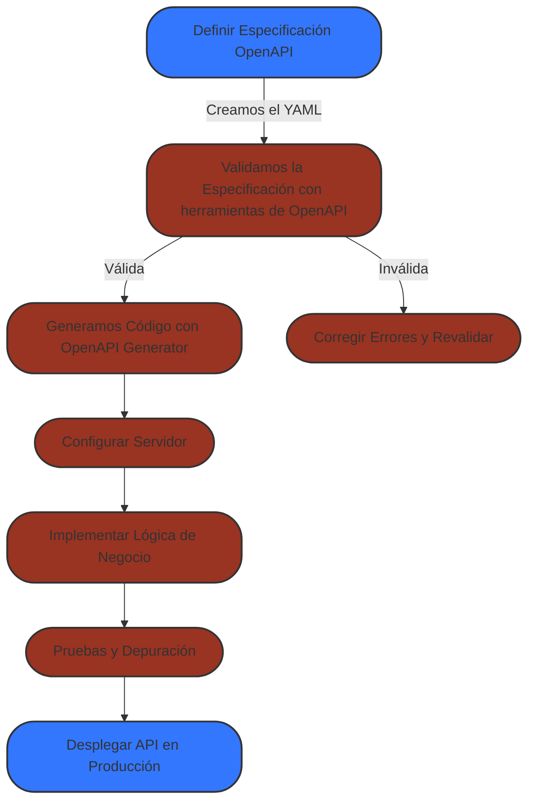

# Diseño de APIs


## Qué son las APIs?

API es el acronimo de API `application programming interface` que traducido al español es `interfaz de programación de aplicaciones` es código  que permite a dos aplicaciones comunicarse entre sí para compartir información y funcionalidades. 

## Qué es una Web API?

Una WEB API utiliza el Protocolo de Transferencia de Hipertexto (HTTP) para transportar datos. HTTP es el protocolo de comunicación que sustenta internet y permite intercambiar diferentes tipos de medios, como texto, imágenes, vídeo y JSON, a través de una red. HTTP utiliza el concepto de Localizador Uniforme de Recursos (es decir, URL) para localizar recursos en internet y cuenta con características que las tecnologías API pueden aprovechar para mejorar la interacción con el servidor, como los métodos de solicitud (p. ej., GET, POST, PUT) y las cabeceras HTTP.

## Guías para escribir APIs

Hay muchas guías para escribir REST APIs, nosotros nos basaremos en las guías de Google [https://google.aip.dev/general](https://google.aip.dev/general).


## Como crearemos nuestras APIs?

Hay muchas maneras de crear APIs, que depende de la tecnología y los frameworks que estes utilizando,  lo usual es que durante el desarrollo de proyectos pequeños usemos un framework como podría ser django, angular, spring, etc... y conforme se vaya necesitando vamos agregando endpoints, con sus respectivas logicas.

Sin embargo cuando trabajos en sistemas que estan escalados esto se convierte en una mala practica de desarollo que es muy dificil de mantener.

Por lo cual, han surgido varias alternatrivas que tratan de centralizar el desarrollo alrededor de las APIs.

Vamos a explorar una de las maneras más eficaces usando Swagger, OpenAPI y TypeSpec.

- [Swagger]()
- [OpenAPI](https://swagger.io/specification/)
- [typespec](https://typespec.io/)


## Desarrollo basada en la documentación

El desarrollo basado en documentación es un método de desarrollo que prioriza las API. En él, primero se diseña y documenta la API; luego, se construyen el servidor y el cliente de la API basándose en la documentación; y, finalmente, se utiliza la documentación de la API para validar las implementaciones del servidor y del cliente. El desarrollo basado en documentación ayuda a reducir las probabilidades de fallos en la integración de la API y proporciona mayor control y visibilidad de los errores de integración.

### La especificación de la API

Las especificaciones de la API representan un contrato entre el servidor y el cliente de la API. Siempre que tanto el cliente como el servidor cumplan la especificación, la integración de la API funcionará.

## OpenAPI

OpenAPI es una especificación estándar para describir, documentar y consumir REST APIs de manera estructurada, se supone que es legible para maquinas y para humanos, sin embargo, es muy verboso este estandar lo cual complica su legibilidad para humanos. 


Antes era  el famoso **Swagger**, pero desde la versión 3.0 se llama OpenAPI Specification (OAS).

### ¿Qué  beneficios trae OpenAPI?

- **Documentar APIs** : Define los endpoints, métodos HTTP, parámetros, respuestas y errores de una API de una manera estructurada y "legible".
- **Permite generar código automáticamente** : Con OpenAPI definimos archivos (`.yaml` o `.json`), y de ellos podemos generar clientes, servidores y SDKs en distintos lenguajes como [openapi-generator](https://github.com/OpenAPITools/openapi-generator).
- **Explorar APIs con Swagger UI**: La pricipal razon de **Swagger UI** es visualizar y probar los endpoints de la API de forma interactiva.
- **Estandar**: Es un estandar de la industria.

### ¿Cómo escribimos OpenAPI?

El archivo se escribe en **YAML** o **JSON**. Por ejemplo:

```yaml title="Ejemplo de OpenAPI"
openapi: 3.0.0
info:
  title: Mi API
  version: 1.0.0
paths:
  /usuarios:
    get:
      summary: Obtiene la lista de usuarios
      responses:
        '200':
          description: Lista de usuarios
          content:
            application/json:
              schema:
                type: array
                items:
                  type: string
```





## References


- [HTTP Status](https://www.iana.org/assignments/http-status-codes/http-status-codes.xhtml)