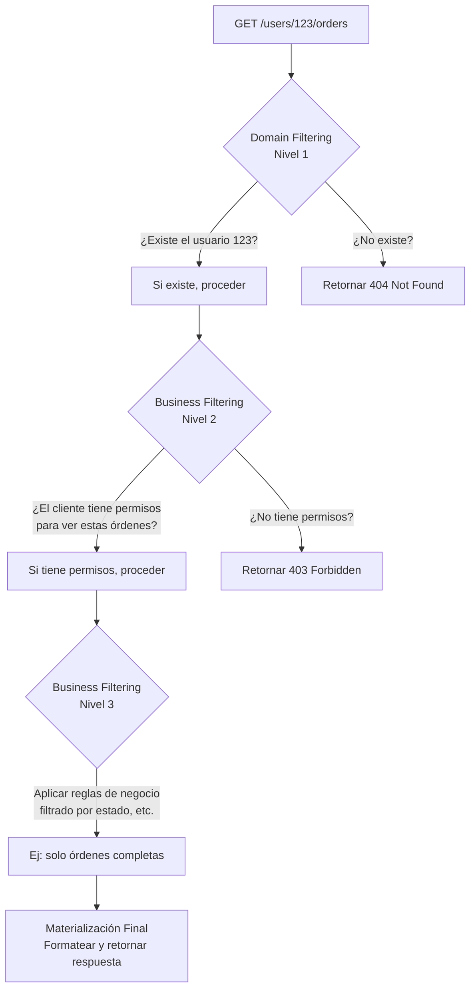

# Domain Filtering, Business Filtering y Resource Modeling

Los conceptos de **Business Filtering** y **Domain Filtering** son cruciales en el **Resource Modeling** y representan dos capas distintas de filtrado que ocurren durante la "materialización" de un recurso, es decir, el proceso de transformar una solicitud HTTP en datos concretos que se devuelven al cliente.


## Diferenciación Conceptual

### 1. **Domain Filtering (Filtrado de Dominio)**
- **¿Qué es?** Filtrado basado en la **estructura de datos y relaciones** del dominio.
- **Enfoque:** ¿A qué datos **tiene acceso** el cliente según la jerarquía natural del sistema?
- **Ejemplo:** Un usuario solo puede ver las órdenes (`/users/123/orders`) que le pertenecen, no las de otros usuarios.

### 2. **Business Filtering (Filtrado de Negocio)**
- **¿Qué es?** Filtrado basado en **reglas de negocio, permisos y estado**.
- **Enfoque:** De los datos a los que tiene acceso, ¿cuáles **puede ver o manipular** según políticas de negocio?
- **Ejemplo:** Un usuario solo puede ver órdenes en estado "completas" o "pendientes", pero no las "canceladas" (si esa es la regla).

## Cómo se integran en el flujo de materialización de un recurso

El proceso típico para materializar un recurso (ej: al llamar a `GET /users/123/orders`) sigue estos pasos:



## Ejemplo Técnico en Código (Pseudocódigo)

Imaginemos el endpoint `GET /users/{user_id}/orders`.

```python
from flask_restful import Resource, reqparse
from models import User, Order
from auth import requires_permission

class UserOrders(Resource):
    
    @requires_permission('view_orders')  # Business Filtering (Cap 1)
    def get(self, user_id):
        # ------------------------------------------------------------------
        # DOMAIN FILTERING - Capa 1: ¿Existe la jerarquía?
        # ------------------------------------------------------------------
        user = User.get_by_id(user_id)
        if not user:
            return {'error': 'User not found'}, 404  # ← Domain filtering falla

        # ------------------------------------------------------------------
        # BUSINESS FILTERING - Capa 2: ¿Puede ver estas órdenes?
        # ------------------------------------------------------------------
        # Lógica de permisos: ¿El cliente actual puede ver las órdenes de este user_id?
        if not current_user.can_view_orders_of(user_id):
            return {'error': 'Insufficient permissions'}, 403  # ← Business filtering falla

        # ------------------------------------------------------------------
        # BUSINESS FILTERING - Capa 3: ¿Qué subconjunto de órdenes puede ver?
        # ------------------------------------------------------------------
        # Regla de negocio: "Los clientes solo ven órdenes completas"
        query = Order.query.filter(Order.user_id == user_id)
        
        # Aquí se aplica la regla de negocio específica
        if current_user.role == 'customer':
            query = query.filter(Order.status == 'completed')  # ← Business filtering
        
        # Filtrado opcional vía query parameters (ej: ?status=shipped)
        status_filter = request.args.get('status')
        if status_filter:
            query = query.filter(Order.status == status_filter)
        
        orders = query.all()

        # ------------------------------------------------------------------
        # MATERIALIZACIÓN: Formatear la respuesta final
        # ------------------------------------------------------------------
        return {'orders': [order.to_dict() for order in orders]}
```

## Tabla Comparativa: Domain vs. Business Filtering

| Aspecto               | Domain Filtering                          | Business Filtering                           |
| --------------------- | ----------------------------------------- | -------------------------------------------- |
| **Base**              | Estructura de datos y relaciones          | Reglas de negocio y permisos                 |
| **Pregunta**          | "¿Existe el recurso en la jerarquía?"     | "¿Puede el cliente actuar sobre este recurso?" |
| **Ejemplo**           | `GET /users/999/orders` (¿existe user 999?) | ¿Puede un manager ver órdenes de otro departamento? |
| **Error Típico**      | `404 Not Found`                           | `403 Forbidden` o `400 Bad Request`          |
| **Dónde se aplica**   | Temprano, en el routing y existencia      | Después, en la lógica de servicio/business   |
| **Relación con DB**   | Verificación de FK y existencia           | Cláusulas `WHERE` complejas                  |


## Cómo se relacionan con el Resource Modeling

1.  **El Resource Modeling define la "forma" y la jerarquía:** La estructura de los endpoints (`/users/{id}/orders`) define el **domain filtering** potencial. Establece la "arena" donde jugarán las reglas de negocio.

2.  **El Business filtering opera dentro de esa forma:** Una vez que el domain filtering ha establecido que se está accediendo a un recurso válido dentro de la jerarquía, el business filtering aplica las reglas para determinar **qué exactamente** de ese recurso es visible o operable.

3.  **La Materialización es el resultado final:** Es el proceso de aplicar ambos filtrados y dar forma final a la respuesta (JSON, XML) que se envía al cliente. Incluye decisions sobre qué campos mostrar (por seguridad o relevancia).

- **Domain Filtering** y **Business Filtering** no son excluyentes, son **capas complementarias** de seguridad y consistencia.
- El **Domain Filtering** es la primera línea de defensa, garantizando la integridad estructural de la API.
- El **Business Filtering** es la segunda línea, garantizando el cumplimiento de las reglas de negocio y de seguridad.
- Juntos, durante la **materialización**, aseguran que la respuesta final sea tanto estructuralmente correcta como segura y adecuada para el contexto del cliente específico.
