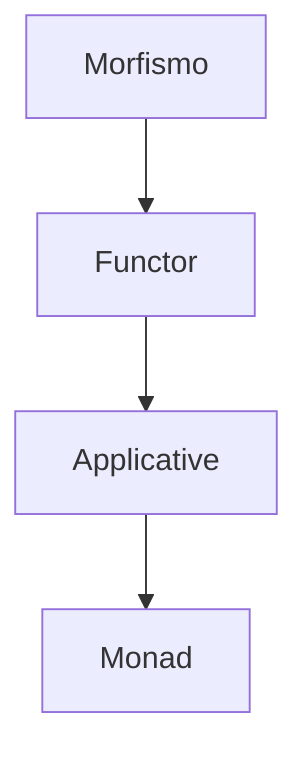

# Funtores, Aplicativos, Mónadas y Morfismos

| Término         | En una frase |
|-----------------|--------------|
| **Morfismo**    | Una función que respeta estructura              |
| **Funtor**      | Mapea funciones dentro de un contenedor         |
| **Applicative** | Aplica funciones también envueltas              |
| **Mónada**      | Encadena operaciones que devuelven contenedores |

Estos no son los tipicos "patrones" de programación, son **patrones matemáticos** conocidos como **"propiedades universales"** que garantizan 

- corrección, 
- composabilidad y 
- seguridad

## Morfismo – "Flecha entre objetos"

### Definición matemática

Un **morfismo** es una **flecha** (función) entre dos **objetos** en una **categoría**, que **respeta la estructura**.

Una categoría tiene:

>- **Objetos** (ej. tipos: `Int`, `String`, `List[Int]`)
>- **Morfismos** (funciones entre objetos)
>- **Composición** (`g ∘ f`)
>- **Identidad** (`id`)

### Ejemplos

Pensemos en dos funciones $f: \mathbb{Z} \rightarrow \{strings\}$ y $g: \{strings\} \rightarrow \{0, 1\}$

En haskell es natural tener este tipo de definiciones

```haskell title="En Haskell"
f: Int → String
g: String → Bool
```

aquí `f` y `g` son **morfismos**, es decir funciones entre tipos de datos!

En python es implicito el ejemplo:

```python title="En Python"
f = lambda x: str(x)      # int → str
g = lambda s: len(s) > 3  # str → bool
```

## Functor – "Mapea objetos y flechas"

### Definición matemática

Un **functor** `F` es un mapeo entre dos categorías que:

1. Mapea **objetos** $\Rightarrow$ $F(A)$, $F(B)$
2. Mapea **morfismos** $\Rightarrow$ $F(f): F(A) \rightarrow F(B)$
3. Preserva **identidad** y **composición**:
   ```haskell
   fmap id      = id
   fmap (g ∘ f) = fmap g ∘ fmap f
   ```

### En programación

```haskell
class Functor f where
  fmap :: (a -> b) -> f a -> f b
```

```python title="Ejemplo Maybe" linenums="1"
class Maybe:
    def __init__(self, value):
        self.value = value

    def fmap(self, f):
        if self.value is None:
            return Maybe(None)
        return Maybe(f(self.value))
```

```python
Maybe(5).fmap(lambda x: x*2)  # -> Maybe(10)
Maybe(None).fmap(lambda x: x*2)  # -> Maybe(None)
```

> `fmap` aplica `f` **dentro del contexto**, preservando la estructura.


## **Applicative Functor** – "Aplica funciones en contexto"

### Definición

Extiende `Functor` para:
- **Levantar** valores puros: `pure :: a -> f a`
- **Aplicar** funciones envueltas: `<*> :: f (a -> b) -> f a -> f b`


```haskell title="En Haskell"
class Functor f => Applicative f where
  pure  :: a -> f a
  (<*>) :: f (a -> b) -> f a -> f b
```

```python title="Maybe como Applicative"
class Applicative:
    @classmethod
    def pure(cls, x): ...

    def ap(self, fab): ...
```

```python title="Funciones curried"
# Funciones curried
add = lambda x: lambda y: x + y

Maybe.pure(add)        # Maybe(<función>)
    .ap(Maybe(3))      # Maybe(<λ y: 3 + y>)
    .ap(Maybe(4))      # Maybe(7)
```

> Permite **combinar efectos** sin anidar.


## Mónada – "Encadena operaciones con efectos"

### Definición matemática

Una **mónada** es un **functor con estructura adicional**:
- `return :: a -> m a` (como `pure`)
- `>>= :: m a -> (a -> m b) -> m b` (bind / flatMap)

### Leyes (cruciales)

1. **Izquierda identidad**: `return x >>= f ≡ f x`
2. **Derecha identidad**: `m >>= return ≡ m`
3. **Asociatividad**: `(m >>= f) >>= g ≡ m >>= (\x -> f x >>= g)`

### En programación

```haskell
class Monad m where
  return :: a -> m a
  (>>=)  :: m a -> (a -> m b) -> m b
```

```python title="Maybe como Mónada"
def bind(m, f):
    if m.value is None:
        return Maybe(None)
    return f(m.value)
```

```python
Maybe(16)
    .bind(lambda x: Maybe(x ** 0.5))   # raíz
    .bind(lambda x: Maybe(x + 1))      # +1
    .bind(lambda x: Maybe(10 / x))     # dividir
# → Maybe(2.0)
```

> **No hay anidamiento**. Cada paso devuelve `Maybe`, y `bind` lo aplana.


## Resumen en tabla

| Concepto       | Origen matemático               | En programación funcional                     | Operación clave         |
|----------------|----------------------------------|-----------------------------------------------|-------------------------|
| **Morfismo**   | Flecha entre objetos            | `a -> b`                                      | Composición `g ∘ f`     |
| **Functor**    | Mapea objetos y flechas         | `fmap :: (a->b) -> f a -> f b`                | `map` / `fmap`          |
| **Applicative**| Aplica funciones en contexto    | `pure` + `<*>`                                | `ap`                    |
| **Monad**      | Encadena efectos con `bind`     | `return` + `>>=`                              | `bind` / `flatMap`      |


```python title="Ejemplo en pipeline de datos"
# Sin mónadas → anidamiento infernal
if user_input:
    n = int(user_input)
    if n > 0:
        sqrt_n = n ** 0.5
        result = 10 / sqrt_n
```

```python
# Con mónadas → limpio y seguro
Maybe(user_input)
    .bind(parse_int)
    .bind(safe_sqrt)
    .bind(lambda x: Maybe(10 / x))
```


## Relación entre ellos



> Cada uno **extiende** al anterior con más poder.


## Ejemplos comunes de mónadas

| Mónada     | Significado                     | `bind` hace... |
|------------|----------------------------------|----------------|
| `Maybe`    | Valor opcional (`None`)         | Propaga `None` |
| `Either`   | Resultado o error                | Propaga error |
| `List`     | No-determinismo                  | Aplica a cada elemento |
| `IO`       | Efectos del mundo real           | Secuencia acciones |
| `State`    | Estado implícito                 | Pasa estado |


## Either

Implementación de **`Either`** en **Python** de forma **completa, idiomática y funcional**, con soporte para:

- `Left` → Error o valor fallido
- `Right` → Valor exitoso
- `map`, `bind` (flatMap), `ap` (para Applicative)
- Métodos útiles: `is_left`, `is_right`, `get_or_else`, `or_else`, etc.


## Implementación completa de `Either`

```python title="Either" linenums="1"
from __future__ import annotations
from typing import Generic, TypeVar, Callable, Any, Union, Optional
from abc import ABC, abstractmethod
from functools import wraps

A = TypeVar('A')
B = TypeVar('B')
E = TypeVar('E')  # Tipo del error (Left)
R = TypeVar('R')  # Tipo del valor correcto (Right)

# ========================
# Either Base Class
# ========================

class Either(Generic[E, R], ABC):
    """Abstract base class for Either."""

    @abstractmethod
    def map(self, f: Callable[[R], B]) -> 'Either[E, B]':
        """Functor: aplica función solo si es Right."""
        pass

    @abstractmethod
    def bind(self, f: Callable[[R], 'Either[E, B]']) -> 'Either[E, B]':
        """Monad: encadena operaciones que devuelven Either."""
        pass

    @abstractmethod
    def ap(self, fab: 'Either[E, Callable[[R], B]]') -> 'Either[E, B]':
        """Applicative: aplica función dentro de Either."""
        pass

    @abstractmethod
    def is_left(self) -> bool:
        pass

    @abstractmethod
    def is_right(self) -> bool:
        pass

    @abstractmethod
    def get_or_else(self, default: R) -> R:
        """Devuelve el valor si es Right, sino el default."""
        pass

    @abstractmethod
    def or_else(self, f: Callable[[E], 'Either[E, B]']) -> 'Either[E, B]':
        """Si es Left, aplica f al error."""
        pass

    @abstractmethod
    def fold(self, left_fn: Callable[[E], B], right_fn: Callable[[R], B]) -> B:
        """Pattern matching: aplica una función según el caso."""
        pass

    # Métodos útiles
    def __repr__(self) -> str:
        return self.fold(
            lambda e: f"Left({e!r})",
            lambda r: f"Right({r!r})"
        )

    def __eq__(self, other: Any) -> bool:
        return self.fold(
            lambda e1: isinstance(other, Left) and e1 == other.value,
            lambda r1: isinstance(other, Right) and r1 == other.value
        )

    # Conveniencia: operadores
    def __rshift__(self, f: Callable[[R], 'Either[E, B]']) -> 'Either[E, B]':
        """Alias para bind: either >> f"""
        return self.bind(f)


# ========================
# Left y Right
# ========================

class Left(Either[E, R]):
    def __init__(self, value: E):
        self.value = value

    def map(self, f: Callable[[R], B]) -> 'Left[E, B]':
        return Left(self.value)  # Ignora la función

    def bind(self, f: Callable[[R], Either[E, B]]) -> 'Left[E, B]':
        return Left(self.value)  # Propaga el error

    def ap(self, fab: Either[E, Callable[[R], B]]) -> 'Left[E, B]':
        return Left(self.value)

    def is_left(self) -> bool:
        return True

    def is_right(self) -> bool:
        return False

    def get_or_else(self, default: R) -> R:
        return default

    def or_else(self, f: Callable[[E], Either[E, B]]) -> Either[E, B]:
        return f(self.value)

    def fold(self, left_fn: Callable[[E], B], right_fn: Callable[[R], B]) -> B:
        return left_fn(self.value)


class Right(Either[E, R]):
    def __init__(self, value: R):
        self.value = value

    def map(self, f: Callable[[R], B]) -> 'Right[E, B]':
        return Right(f(self.value))

    def bind(self, f: Callable[[R], Either[E, B]]) -> Either[E, B]:
        return f(self.value)

    def ap(self, fab: Either[E, Callable[[R], B]]) -> Either[E, Union[B, R]]:
        return fab.map(lambda g: g(self.value))

    def is_left(self) -> bool:
        return False

    def is_right(self) -> bool:
        return True

    def get_or_else(self, default: R) -> R:
        return self.value

    def or_else(self, f: Callable[[E], Either[E, B]]) -> 'Right[E, R]':
        return self  # Ignora el error

    def fold(self, left_fn: Callable[[E], B], right_fn: Callable[[R], B]) -> B:
        return right_fn(self.value)


# ========================
# Funciones auxiliares
# ========================

def left(value: E) -> Left[E, Any]:
    return Left(value)

def right(value: R) -> Right[Any, R]:
    return Right(value)

def either(left_fn: Callable[[E], B], right_fn: Callable[[R], B]) -> Callable[[Either[E, R]], B]:
    """Decorator para pattern matching."""
    @wraps(right_fn)
    def wrapper(e: Either[E, R]) -> B:
        return e.fold(left_fn, right_fn)
    return wrapper
```

## Ejemplos de uso

### 1. **Manejo seguro de división**

```python
def safe_div(x: float, y: float) -> Either[str, float]:
    return left("División por cero") if y == 0 else right(x / y)

result = (
    right(10)
    .bind(lambda x: safe_div(x, 2))
    .bind(lambda x: right(x + 5))
    .bind(lambda x: safe_div(x, 0))  # ¡Error!
)

print(result)  # Left('División por cero')
```


### 2. **Pipeline de validación**

```python
def parse_int(s: str) -> Either[str, int]:
    try:
        return right(int(s))
    except ValueError:
        return left(f"No es número: {s}")

def validate_positive(n: int) -> Either[str, int]:
    return left("Debe ser positivo") if n <= 0 else right(n)

pipeline = (
    right("42")
    .bind(parse_int)
    .bind(validate_positive)
    .map(lambda x: x * 2)
)

print(pipeline)  # Right(84)
```


### 3. **Pattern matching con `fold`**

```python
result = right(5).bind(lambda x: safe_div(10, x))

message = result.fold(
    lambda err: f"Error: {err}",
    lambda val: f"Éxito: {val}"
)

print(message)  # Éxito: 2.0
```


### 4. **Applicative: combinar funciones**

```python
add = lambda x: lambda y: x + y
mul = lambda x: lambda y: x * y

result = (
    right(add)
    .ap(right(3))
    .ap(right(4))
)

print(result)  # Right(7)
```


### 5. **Recuperación de errores con `or_else`**

```python
def fallback(e: str) -> Either[str, int]:
    print(f"Recuperando de: {e}")
    return right(0)

result = left("Falló").or_else(fallback)
print(result)  # Right(0)
```


### 6. **Decorator con `either`**

```python
@either(
    lambda err: f"Error: {err}",
    lambda val: f"Ok: {val}"
)
def process(x: Either[str, int]) -> str:
    pass  # No hace nada, solo usa el decorador

print(process(right(42)))  # Ok: 42
print(process(left("boom")))  # Error: boom
```


## Ventajas de `Either`

| Característica               | Beneficio |
|-----------------------------|---------|
| **No excepciones**          | Errores explícitos |
| **Composición segura**      | `bind` propaga errores |
| **Pattern matching**        | `fold` es como `match` |
| **Funcional puro**          | Sin efectos colaterales |
| **Mejor que `try/except`**  | Más claro y testable |


## Resumen

```python
right(10) >> (lambda x: right(x * 2)) >> (lambda x: safe_div(x, 0))
# → Left('División por cero')
```

```python
right("123") >> parse_int >> validate_positive
# → Right(123)
```


