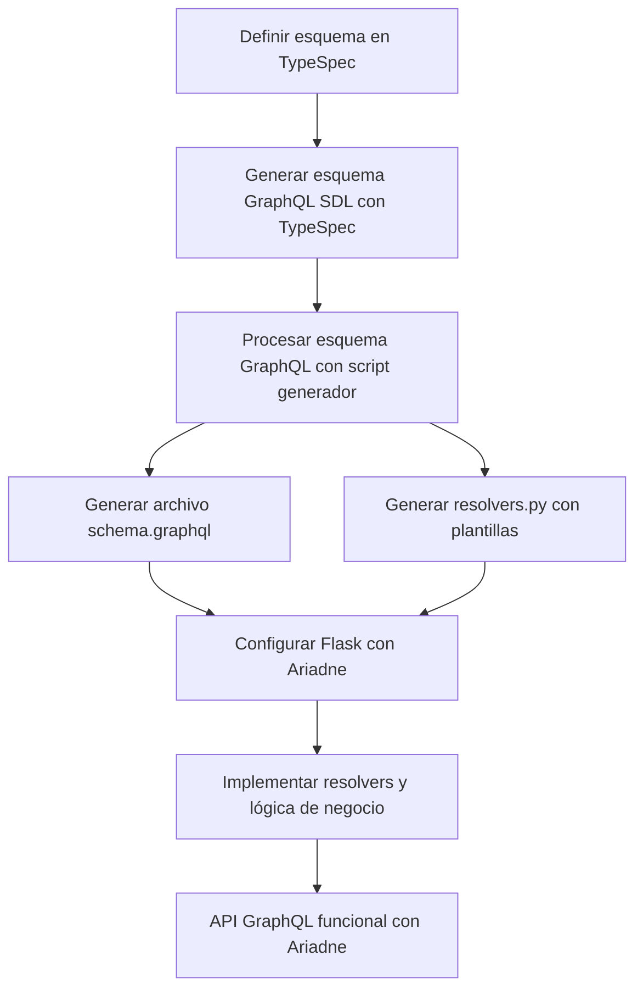

# Migración de API REST a GRAPHQL


Migrar una API REST implementada con Flask a GraphQL requiere varias herramientas y pasos específicos para una transición efectiva y suave.


---

### **Herramientas Necesarias**

1. **Framework para GraphQL**
   - [Graphene](https://graphene-python.org/): Una biblioteca de Python que simplifica la creación de APIs GraphQL en Flask.
   - [Ariadne](https://ariadnegraphql.org/): Otra opción que proporciona mayor flexibilidad y soporte para esquemas definidos en SDL (Schema Definition Language).

2. **Flask Extensions**
   - **Flask-GraphQL**: Extensión que conecta Graphene con Flask para exponer los endpoints de GraphQL.
   - **Flask-CORS**: Para manejar CORS si tu API se consume desde diferentes orígenes.

3. **GraphQL Playground**
   - Herramientas como [GraphQL Playground](https://github.com/graphql/graphql-playground) o [Apollo Studio Explorer](https://studio.apollographql.com/) son útiles para probar y explorar las queries y mutaciones.

4. **ORM o Biblioteca de Bases de Datos**
   - Si ya estás usando algo como SQLAlchemy con Flask, puedes reutilizarlo con Graphene para definir tus resolvers.
   - Alternativamente, puedes usar una biblioteca más moderna como Tortoise ORM.

5. **Herramientas de Depuración**
   - **Flask-DebugToolbar**: Para depurar tus endpoints durante la transición.
   - **GraphQL IDE**: Para visualizar y depurar resoluciones de datos en tiempo real.

---

### **Pasos para la Migración**

1. **Evalua la API Existente**

   - Identifica las rutas REST que puedes migrar de inmediato y aquellas que requieren ajustes.
   - Analiza cómo se estructuran los datos, ya que GraphQL utiliza un enfoque jerárquico.
   - Es comun que distintas organizaciones o departamentos en usen un mismo codigo de maneras diferentes identifica como cada cliente de la API crea sus endpoints.

2. **Configurar el Entorno**

   - Instala las dependencias necesarias:
     ```bash
     pip install graphene flask-graphql flask-cors
     ```

3. **Definir el Esquema de GraphQL**

   - Crea un esquema que represente las entidades y relaciones de tu API.
   - Ejemplo básico:
     ```python
     import graphene

     class Query(graphene.ObjectType):
         hello = graphene.String()

         def resolve_hello(root, info):
             return "¡Hola desde GraphQL!"

     schema = graphene.Schema(query=Query)
     ```

4. **Integrar GraphQL con Flask**

   - Crea un endpoint para GraphQL:
     ```python
     from flask import Flask
     from flask_graphql import GraphQLView
     from schema import schema

     app = Flask(__name__)

     app.add_url_rule(
         "/graphql",
         view_func=GraphQLView.as_view(
             "graphql",
             schema=schema,
             graphiql=True,  # Habilita GraphiQL para pruebas
         ),
     )

     if __name__ == "__main__":
         app.run(debug=True)
     ```

5. **Implementar Resolvers**

   - Los resolvers definen cómo obtener los datos para cada tipo y campo en tu esquema.
   - Ejemplo con SQLAlchemy:
     ```python
     from models import UserModel

     class Query(graphene.ObjectType):
         users = graphene.List(UserType)

         def resolve_users(root, info):
             return UserModel.query.all()
     ```

6. **Probar y Validar**

   - Usa herramientas como GraphQL Playground para probar tus queries y mutaciones.
   - Compara las respuestas con los endpoints REST existentes.

7. **Migrar Gradualmente**

   - Implementa GraphQL en paralelo con REST.
   - Expón ambos tipos de endpoints para que los consumidores puedan cambiar gradualmente a GraphQL.

8. **Optimizar y Documentar**

   - Optimiza tus resolvers para minimizar las consultas innecesarias a la base de datos.
   - Documenta el nuevo esquema para facilitar la adopción.

---

### **Consideraciones Finales**
- **Autenticación y Autorización**:
  Si ya tienes autenticación implementada en REST, asegúrate de adaptarla a GraphQL (por ejemplo, utilizando middleware en Flask).

- **Manejo de Errores**:
  GraphQL tiene una forma específica de manejar errores en las respuestas, por lo que debes adaptarte.

- **Monitorización**:
  Usa herramientas como Apollo Server o GraphQL Tracing para monitorear el rendimiento de tus resolvers.


## TypeSpec a Código

Para generar código con **Ariadne** a partir de los esquemas definidos en **TypeSpec** (o cualquier archivo de esquema GraphQL), puedes seguir un enfoque similar al flujo de trabajo basado en OpenAPI, pero adaptado al ecosistema de GraphQL.



---

### **1. Flujo General**
1. **Definir Esquemas**: Usa TypeSpec (o directamente GraphQL SDL) para definir los tipos y resolvers de tu API.
2. **Exportar a GraphQL SDL**: Usa TypeSpec para generar un esquema GraphQL.
3. **Generar Código Base para Ariadne**: Crear un script personalizado que lea el esquema GraphQL y genere:
   - Resolvers para los tipos definidos.
   - Un archivo de esquema SDL compatible con Ariadne.

---

### **2. Herramientas Necesarias**
- **TypeSpec**: Para definir y generar el esquema GraphQL.
- **Python y Ariadne**: Para implementar la API GraphQL.
- **Un script generador**: Personalizado para procesar el archivo SDL y autogenerar los resolvers.

---

### **3. Paso a Paso**

#### **Paso 1: Definir el Esquema en TypeSpec**
Define el esquema en TypeSpec y configura la salida para GraphQL.

**Ejemplo: `api.tsp`**
```typescript
using OpenAPI;

@serviceTitle("Ejemplo GraphQL API")
namespace EjemploAPI;

model User {
  id: int32;
  name: string;
  email: string;
}

@route("/graphql")
interface Users {
  listUsers(): User[];
  createUser(user: User): User;
}
```

#### **Paso 2: Generar Esquema GraphQL**
Ejecuta el compilador de TypeSpec para generar un archivo SDL compatible con GraphQL.

**Comando:**
```bash
tsp compile api.tsp --emit graphql
```

Esto generará un archivo llamado `schema.graphql` con el esquema SDL.

---

#### **Paso 3: Crear Código Base para Ariadne**
Usa un script para generar el código base de Ariadne a partir del esquema SDL. Este script procesará el archivo `schema.graphql` y creará:

1. **Resolvers Vacíos**: Lugares donde implementarás la lógica de negocio.
2. **Unión del Esquema**: Cargar automáticamente el esquema en Ariadne.

**Script Generador (`generate_ariadne_code.py`):**
```python
import os
from graphql import build_schema, print_schema
from graphql.utils.schema_printer import print_introspection_schema

# Ruta al esquema GraphQL
SCHEMA_FILE = "schema.graphql"

# Directorio de salida
OUTPUT_DIR = "ariadne_generated"

# Generar resolvers vacíos
def generate_resolvers(schema):
    resolvers = []
    for type_name, graphql_type in schema.type_map.items():
        if type_name.startswith("__"):  # Ignorar tipos internos
            continue
        if graphql_type.ast_node and graphql_type.ast_node.kind == "ObjectTypeDefinition":
            resolvers.append(f"@query.field('{type_name.lower()}')\ndef resolve_{type_name.lower()}(*_):\n    pass\n")
    return resolvers

# Escribir archivos generados
def write_generated_files(schema, resolvers):
    os.makedirs(OUTPUT_DIR, exist_ok=True)

    # Escribir esquema SDL
    with open(os.path.join(OUTPUT_DIR, "schema.graphql"), "w") as schema_file:
        schema_file.write(print_schema(schema))

    # Escribir resolvers
    with open(os.path.join(OUTPUT_DIR, "resolvers.py"), "w") as resolvers_file:
        resolvers_file.write("from ariadne import QueryType\n\n")
        resolvers_file.write("query = QueryType()\n\n")
        resolvers_file.writelines(resolvers)
        resolvers_file.write("\n# Añade tus resolvers aquí.\n")

# Proceso principal
def main():
    if not os.path.exists(SCHEMA_FILE):
        print(f"El archivo {SCHEMA_FILE} no existe.")
        return

    with open(SCHEMA_FILE, "r") as f:
        schema = build_schema(f.read())

    resolvers = generate_resolvers(schema)
    write_generated_files(schema, resolvers)
    print(f"Código generado en el directorio {OUTPUT_DIR}")

if __name__ == "__main__":
    main()
```

---

#### **Paso 4: Ejecutar el Generador**
Ejecuta el script para generar los archivos necesarios.

```bash
python generate_ariadne_code.py
```

Esto creará:
- `ariadne_generated/schema.graphql`: Contiene el esquema SDL.
- `ariadne_generated/resolvers.py`: Plantillas para los resolvers.

**Ejemplo de Archivo `resolvers.py`:**
```python
from ariadne import QueryType

query = QueryType()

@query.field('listUsers')
def resolve_list_users(*_):
    # Implementa la lógica para listar usuarios aquí
    return []

@query.field('createUser')
def resolve_create_user(*_, user):
    # Implementa la lógica para crear un usuario aquí
    return user
```

---

#### **Paso 5: Integrar en Flask con Ariadne**
Configura Flask y Ariadne para usar los archivos generados.

**Ejemplo: `app.py`**
```python
from flask import Flask, request, jsonify
from ariadne import load_schema_from_path, make_executable_schema, graphql_sync
from ariadne.constants import PLAYGROUND_HTML
from ariadne_generated.resolvers import query

app = Flask(__name__)

# Cargar esquema
type_defs = load_schema_from_path("ariadne_generated/schema.graphql")
schema = make_executable_schema(type_defs, query)

@app.route("/graphql", methods=["GET", "POST"])
def graphql_server():
    if request.method == "GET":
        return PLAYGROUND_HTML, 200

    data = request.get_json()
    success, result = graphql_sync(schema, data, context_value=request, debug=True)
    status_code = 200 if success else 400
    return jsonify(result), status_code

if __name__ == "__main__":
    app.run(debug=True)
```

---

### **6. Ventajas de Este Flujo**
- **Automatización:** Evita escribir manualmente los resolvers y el esquema.
- **Consistencia:** El esquema se define en un solo lugar (TypeSpec).
- **Escalabilidad:** Puedes actualizar el esquema en TypeSpec y regenerar los resolvers rápidamente.
- **Ariadne-Friendly:** Compatible con las herramientas y extensiones de Ariadne.

---


