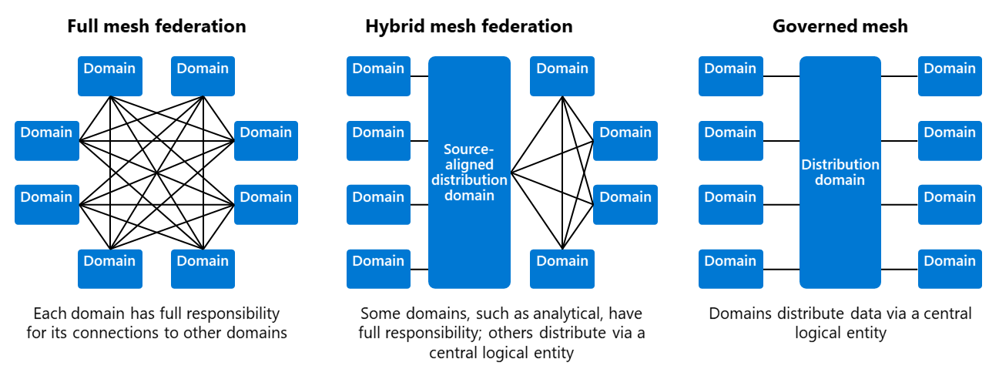

# Microservicios

# Arquitectura de Datos

## Data Mesh: El balance entre centralización y descentralización.

Una arquitectura de malla distribuida de datos con ownership entre equipos,
con gobernanza federada y descentralizada de productos basados en datos.
La arquitectura de malla de datos contrasta de otras arquitecturas de datos porque
es altamente decentralizada.

- Federación de malla completa
- Federacion de malla hibrida.
- Malla gobernada.

