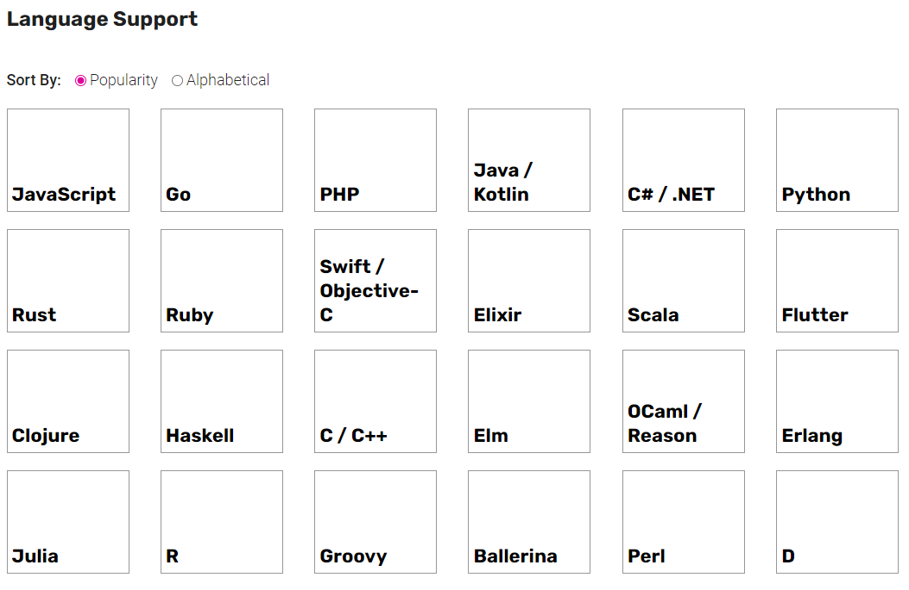

# Aprendiendo GraphQL

GraphQL funciona como un contenedor para todas las fuentes de datos que podamos tener en nuestra organización.

## ¿Qué es?

GraphQL es un lenguaje para crear querys de manera ágil y sencilla.

Con el poder buscar información de todas las fuentes de información que pueda ser colectada dentro de tu organización.

GraphQL cuenta con un gran soporte tenemos una gran variedad de lenguajes soportados y para cada lenguaje tenemos varias opciones:

Empezaremos nuestro aprendizaje con las bibliotecas Apollo(NodeJS) y Ariadne (Python):

1. Familiarizase con los conceptos básicos de GraphQL:
   - Comprender los fundamentos de GraphQL, como 
        - los esquemas, 
        - tipos de datos, 
        - consultas, 
        - mutaciones.
   - Leer la especificación oficial de GraphQL [https://graphql.org/learn/](https://graphql.org/learn/) .

2. Exploraremos la documentación de Apollo y Ariadne:
   - Los sitios web oficiales de [Apollo](https://www.apollographql.com/) y [Ariadne](https://ariadnegraphql.org/) para acceder a su documentación.

3. Configuraremos entornos de desarrollo:
   - Configuraremos un entorno de desarrollo local con Nodejs.
   - Crearemos un nuevo proyecto para comenzar a trabajar con GraphQL y Apollo/Ariadne.
4. Crearemos una base de datos MySQL, y pondremos un poco de data que nos permita probar GraphQL.
5. Revisaremos dos servidores para crear servidores GraphQL asi como realizar algunas pruebas sobre ambos utilizando las misma base de datos MySQL.
    - Apollo Server:
        - Apollo Server es una biblioteca de Node.js que te permite crear un servidor GraphQL fácilmente.
        - Sigue los tutoriales y guías de Apollo Server para aprender cómo definir esquemas, resolver consultas y mutaciones, trabajar con tipos de datos y realizar validaciones.

    - Ariadne Server:
        - Ariadne es una biblioteca de Python para construir servidores GraphQL.
        - Sigue la documentación y ejemplos de Ariadne para aprender cómo definir esquemas, resolver consultas y mutaciones utilizando Python.
6. Compararemos algunas librerías de NodeJS y Python:
    - Servers: 
        - GraphQL.js: The reference implementation of the GraphQL specification, designed for running GraphQL in a Node.js environment.
        - Apollo Server: A GraphQL server from Apollo that works with any Node.js HTTP framework
        - graphql-yoga: GraphQL Yoga is a batteries-included cross-platform GraphQL over HTTP spec-compliant GraphQL Server using Envelop and GraphQL Tools.
        - Mercurius: Mercurius is a flexible and extendible GraphQL adapter for Fastify, a blazing-fast web framework with the least overhead and a powerful plugin architecture.
        - GraphQL Helix: A collection of utility functions for building your own GraphQL HTTP server.
        - GraphQLBox Server: An extensible GraphQL server with modules for caching, request parsing, debugging, subscriptions and more...
    - Clients:
        - Apollo Client: A powerful JavaScript GraphQL client, designed to work well with React, React Native, Angular 2, or just plain JavaScript.