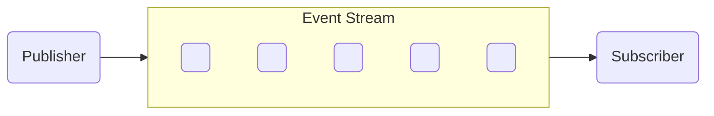
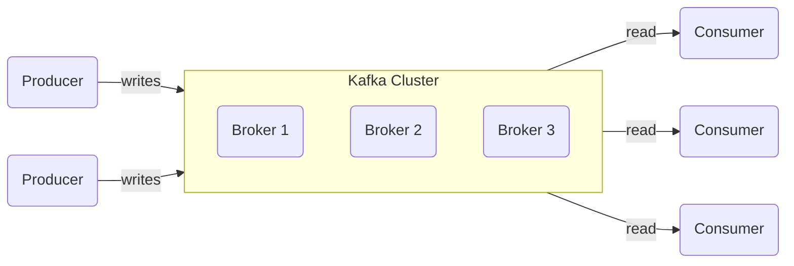
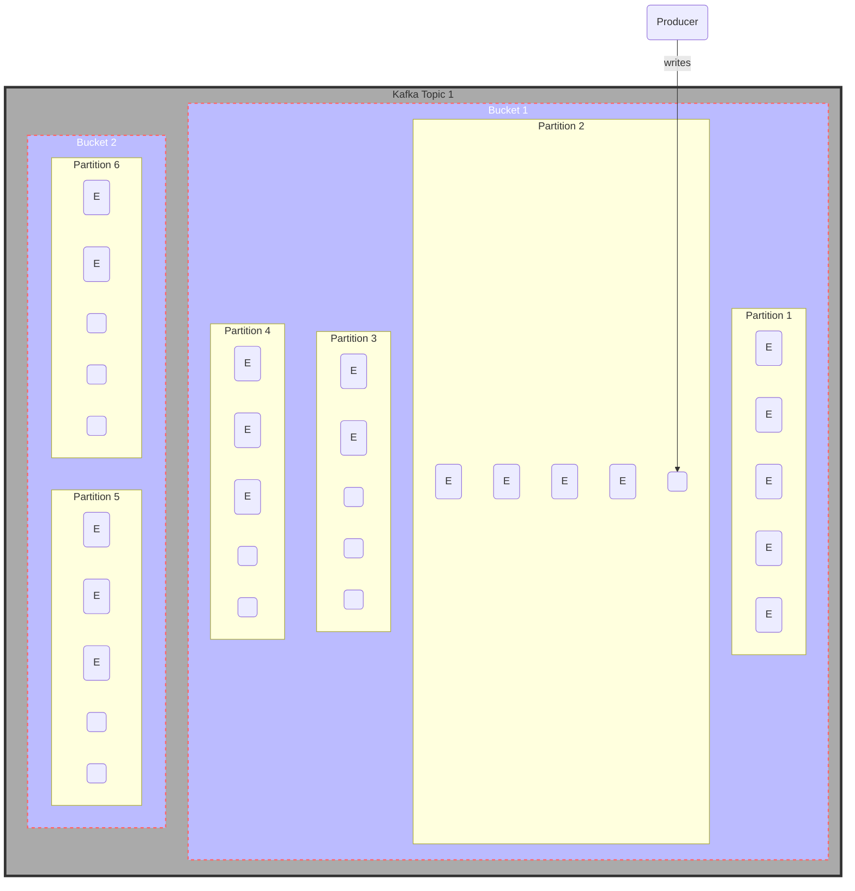
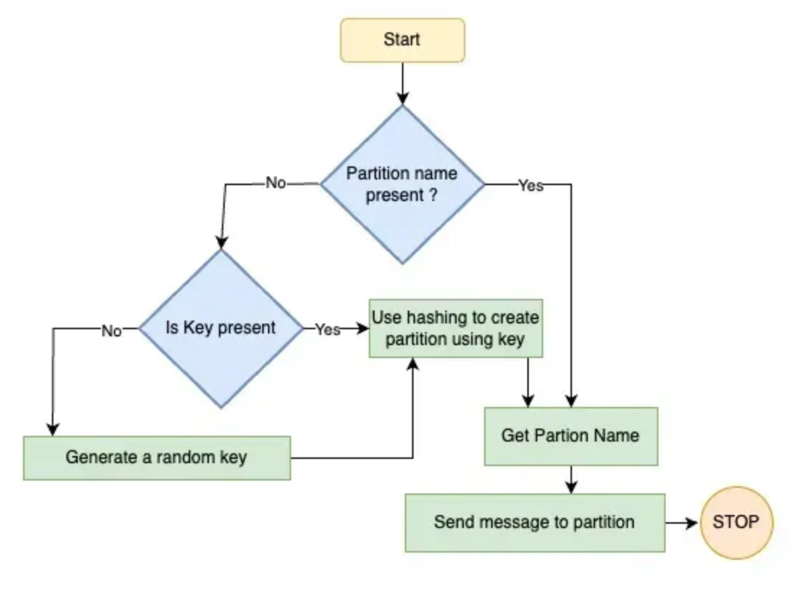
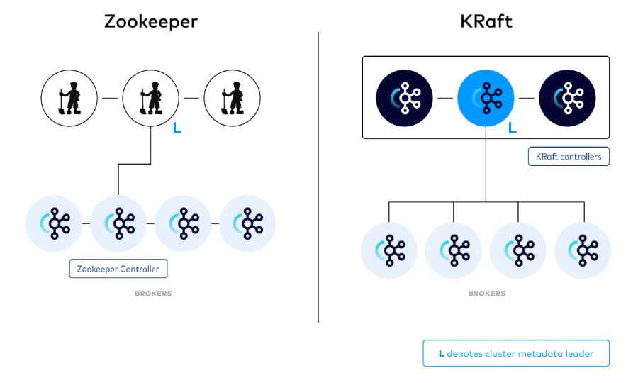

# Apache Kafka

Apache Kafka es un intermediario de mensajes.

Apache Kafka is una plataforma que guarda eventos distribuidos y stream-processing. Esta desarrollado principalmente en JAVA y Scala. El objetivo del proyecto es crear una plataforma que
- unifica
- high-throughput
- low-latency
que nos permite manejar feeds de datos en real time.

Es decir, Apache Kafka es una plataforma de transmisión de eventos escalable, de alto rendimiento, baja latencia y tolerante a fallas.

Algunos casos de uso más relevantes de Kafka son:

- Log processing and analysis
- Data streaming in recommendations
- System monitoring and alerting
- CDC (Change data capture)
- System migration

## ¿Qué es la transmisión de eventos(conocido normalmente como stream-processing)?

**Event Streaming** es un mecanismo que permite el flujo continuo de eventos entre componentes utilizando un **bus de eventos**. El **Event Bus**(bus de eventos) es responsable de recopilar, procesar y almacenar datos como un flujo de registros continuos. Esto lo convierte en un candidato adecuado para crear microservicios basados en bus de eventos capaces de manejar una gran cantidad de mensajes para cualquier sistema empresarial.

Internamente, Kafka mantiene una secuencia de registros ordenada en el tiempo en la cual solo se pueden agregar registros(append-only). Los mensajes nuevos se agregan(append) al final del registro(log) y se procesan en orden FIFO.

Kafka es una plataforma distribuida de transmisión de eventos que permite enviar y recibir grandes volúmenes de datos con baja latencia. Esto significa que si alguna vez necesita crear canales de transmisión de datos en tiempo real y aplicaciones que procesen y analicen datos en tiempo real, definitivamente vale la pena considerar este tipo de servicio en su backend.

## Arquitectura de Kafka

Kafka almacena eventos como unidades atómicas de datos. Internamente, el almacenamiento de Kafka se divide en temas(topics), los topics en depósitos(buckets) y los buckets en particiones(partitions). Los eventos se almacenan dentro de partitions.

- **Topics**: se utilizan para la categorización de eventos. Por ejemplo si tenemos dos tipos de evento `order_placed` y `order_approved`, podemos crear dos topics.
- **Buckets**: son para priorización. A cada bucket se le puede asignar una prioridad diferente. Se prefieren los buckets con mayor prioridad.
- **Partitions**: son para escalamiento horizontal. Las particiones se pueden distribuir entre nodos, lo que permite a Kafka manejar eventos a gran escala, ya que tenemos múltiples flujos disponibles para procesar, cada uno asociado con una partición diferente.
- **Producer**: es un cliente de Kafka que publica mensajes en un topic de Kafka. Los mensajes pueden contener nombres de partición explícitamente o claves. Si el nombre de la partición está presente, el mensaje está destinado a la partición especificada. Si el nombre de la partición no está presente pero la clave sí, Kafka utiliza un algoritmo hash para traducir la clave a la partición. Si no hay ninguno presente, se utiliza una partición aleatoria teniendo en mente una distribución uniforme. 
- **Consumer**: lee mensajes de particiones de forma ordenada en el tiempo.
- **Broker**: cada servidor Kafka es un agente(Broker). responsable de asignar compensación a los mensajes y almacenarlos en una partición.
- **Cluster**: es un grupo de nodos intermediarios de los cuales el nodo Controlador es responsable de asignar particiones a los intermediarios. También realiza tareas administrativas, como la supervisión de fallos.
- Apache Kafka Raft (**KRaft**): es el protocolo de consenso utilizado para mantener sincronizadas las réplicas, la replicación de respaldo primario y la replicación basada en quórum. Anteriormente se utilizaba ZooKeper en lugar de Kraft. 

Para empezar a aprender kafka usaremos un servicio que ya cuente con un cluster de kafka pre configurado y aprenderemos a crear producers y consumers con python.

## Apache Kafka Python Client

