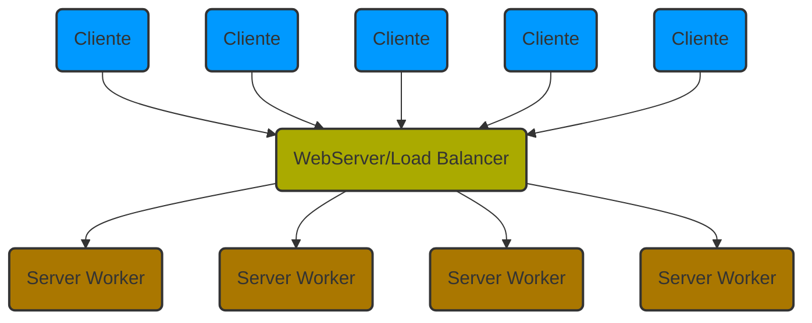
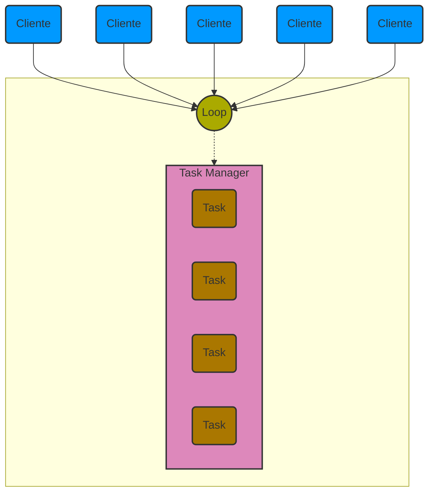

# Sync vs Async

Los términos `sync` y `async` hacen referencia a las maneras en las cuales aplicaciones trabajan con la concurrencia. El término `sync` hace uso del soporte de hilos dado por el sistema operativo y los procesos para implementar concurrencia.

En este caso tenemos clientes enviando `request` a la aplicación. En el caso de aplicaciones web, el punto de acceso publico para la aplicación es un `servidor web` que trabaja como `load balancer` distribuyendo los `request` entre un `pool` de `server workers`, los cuales pueden ser:
- procesos
- hilos(threads)
- combinación de ambos.

Los workers ejecutan los requests conforme son asignados a ellos a traves de un balanceador de cargar(load balancer).
En python esto sera uno de nuestro mejores recursos ya que podemos definir multiples workers en una misma computadora con multiples cores, esto no puede ser asi para un una aplicación común en python debido a las limitaciones impuestas por el Global Interpreter Lock(GIL).

Uno de los principales componentes en el desarrollo de la plataforma es elegir el número apropiado de workers para prevenir y minimizar el bloqueo de request.

Para el caso del servidor asíncrono es mas complicado tener una configuración especifica, el siguiente es un ejemplo:

Este tupo de servidor corre un único proceso que es manejado por un loop. El loop debe ser un eficiente task manager y scheduler que crea tareas(task) para ejecutar los requests que son enviados por los clientes.

Una diferencia significativa es que los server workers tienen una larga vida, mientras las task asíncronas son creadas para realizar una tarea especifica, una vez terminada dicha tarea los task son destruidos.

Una aplicación `async` se basa exclusivamente en multi-tareas cooperativas. Esto quiere decir que cuando una tarea necesita esperar por un recurso externo, este le avisa al loop(nuestro task manager), que necesita para continuar, entonces le deja el control al loop, hasta que el recurso esta disponible y entonces el loop le regresa lo antes posible el control, mientras tanto el loop puede usar los recursos de este task para trabajar en otra tarea.

Una aplicación asíncrona se ejecuta en un solo proceso y en un solo hilo. Para poder beneficiarse del computo asíncrono es necesario que la aplicación contenga tareas que frecuentemente se bloquean por I/O y que no gasten mucho CPU.

Para maximizar la utilización de multiples CPUs al usar un servidor asíncrono es común crear soluciones híbridas, que agregan un balanceador de carga y corren un servidor asíncrono en cada CPU

```mermaid
graph TD;
    client1(Cliente)
    client2(Cliente)
    client3(Cliente)
    client4(Cliente)
    client5(Cliente)
    ELB(WebServer/Load Balancer)
    client1-->ELB
    client2-->ELB
    client3-->ELB
    client4-->ELB
    client5-->ELB
    subgraph TM1[" "]
        LOOP1(("Loop"))
        subgraph TASK1["Task Manager"]
            task11(Task)
            task12(Task)
            task13(Task)
            task14(Task)
        end
    end
    subgraph TM2[" "]
        LOOP2(("Loop"))
        subgraph TASK2["Task Manager"]
            task21(Task)
            task22(Task)
            task23(Task)
            task24(Task)
        end
    end
    subgraph TM3[" "]
        LOOP3(("Loop"))
        subgraph TASK3["Task Manager"]
            task31(Task)
            task32(Task)
            task33(Task)
            task34(Task)
        end
    end
    ELB-->TM1
    ELB-->TM2
    ELB-->TM3
    LOOP1-.->TASK1
    LOOP2-.->TASK2
    LOOP3-.->TASK3
    style client1 fill:#0099ff,stroke:#333,stroke-width:2px
    style client2 fill:#0099ff,stroke:#333,stroke-width:2px
    style client3 fill:#0099ff,stroke:#333,stroke-width:2px
    style client4 fill:#0099ff,stroke:#333,stroke-width:2px
    style client5 fill:#0099ff,stroke:#333,stroke-width:2px
    style ELB fill:#AAAA00,stroke:#333,stroke-width:2px
    style LOOP1 fill:#AAAA00,stroke:#333,stroke-width:2px
    style LOOP2 fill:#AAAA00,stroke:#333,stroke-width:2px
    style LOOP3 fill:#AAAA00,stroke:#333,stroke-width:2px
    style task11 fill:#AA7700,stroke:#333,stroke-width:2px
    style task12 fill:#AA7700,stroke:#333,stroke-width:2px
    style task13 fill:#AA7700,stroke:#333,stroke-width:2px
    style task14 fill:#AA7700,stroke:#333,stroke-width:2px
    style task21 fill:#AA7700,stroke:#333,stroke-width:2px
    style task22 fill:#AA7700,stroke:#333,stroke-width:2px
    style task23 fill:#AA7700,stroke:#333,stroke-width:2px
    style task24 fill:#AA7700,stroke:#333,stroke-width:2px
    style task31 fill:#AA7700,stroke:#333,stroke-width:2px
    style task32 fill:#AA7700,stroke:#333,stroke-width:2px
    style task33 fill:#AA7700,stroke:#333,stroke-width:2px
    style task34 fill:#AA7700,stroke:#333,stroke-width:2px
    style TASK1 fill:#DD88BB,stroke:#333,stroke-width:2px
    style TASK2 fill:#DD88BB,stroke:#333,stroke-width:2px
    style TASK3 fill:#DD88BB,stroke:#333,stroke-width:2px
```

Hay dos métodos para crear aplicaciones asíncronas, que se basan en dos métodos:
- Coroutines
- [Greenlet](https://greenlet.readthedocs.io/en/latest/)

Frameworks que permiten crear aplicaciones web asíncronas con coroutines son:
- [aiohttp](https://docs.aiohttp.org/en/stable/)
- [sanic](https://sanic.readthedocs.io/en/latest/)
- [FastAPI](https://fastapi.tiangolo.com/)
- [Tornado](https://www.tornadoweb.org/en/stable/)

La ventaja de los greenlets es que nos permiten cambiar nuestro código síncrono en asíncrono de manera muy simple con pocos cambios, mientras que para las coroutines se necesita una sintaxis muy especifica.

En el caso de greenlets tenemos los siguientes frameworks:
- [Gevents](https://www.gevent.org/)
- [Eventlet](https://eventlet.net/)
- [Meinheld](https://meinheld.org/)

Una cosa a considerar es que el performance no se ve afectado directamente por usar computo asíncrono o síncrono, esto depende más del `context-switching` y la `scalability`.

