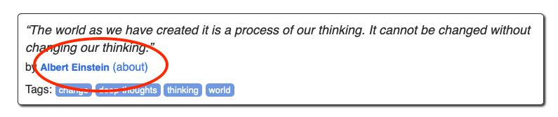
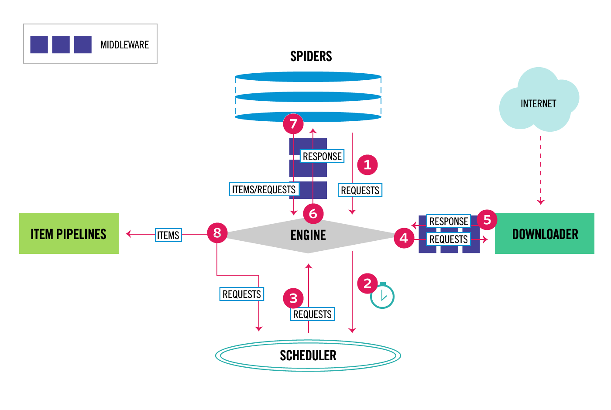

# Tutorial of Scrapy
## Notes of Scrapy
Maybe the most common tools to scrap are:
- Selenium
- BeautifulSoup
- Scrapy

Selenium it is a framewrok to perform unit test on website while BeautifulSoup is a library for parsing HTML and XML and Scrapy is a web scraping framework.

Then logically learn scrapy is a must for data engineer or data scientist. In my case the best option has been some kind of mix between Selenium and Scrapy. Now we will begin:

## Initialize scrapy project
Firstly we initialize a scrapy project
```
$ scrapy startproject <name_project>
```
## Create spider
### create spider class
```
import scrapy

class Attribute1Spider(scrapy.Spider):
    name = "attribute1"

    def start_requests(self):
        urls = [
            'http://site1/',
            'http://site2/',
        ]
        for url in urls:
            yield scrapy.Request(url=url, callback=self.parse)

    def parse(self, response):
        page = response.url.split("/")[-2]
        filename = 'attribute1-%s.html' % page
        with open(filename, 'wb') as f:
            f.write(response.body)
        self.log('Saved file %s' % filename)
``` 
## To analize the information of the site we can enable a python shell
```
$ scrapy shell https://quotes.toscrape.com/
>>> response.css('li.next a::attr(href)').get()
'/page/2'
```

Now we can write the following code for the spider to go over all pages to get all quotes:

```
import scrapy

class QuotesSpider(scrapy.Spider):
    name = "quotes"

    start_urls = ['http://quotes.toscrape.com']

    def parse(self, response):
        self.logger.info('hello this is my first spider')
        quotes = response.css('div.quote')
        for quote in quotes:
            yield {
                'text': quote.css('.text::text').get(),
                'author': quote.css('.author::text').get(),
                'tags': quote.css('.tag::text').getall(),
            }

        next_page = response.css('li.next a::attr(href)').get()

        if next_page is not None:
            next_page = response.urljoin(next_page)
            yield scrapy.Request(next_page, callback=self.parse)
```
`next_page = response.urljoin(next_page)` gets the full URL and `yield` `scrapy.Request(next_page, callback=self.parse)` sends a new request to get the next page and use a callback function to call the same parse function to get the quotes from the new page.

Shortcuts can be used to further simplify the code above: see this section. Essentially, `response.follow` supports relative URLs (no need to call `urljoin`) and automatically uses the `href` attribute for `<a>` . So, the code can be shortened further:
```
for a in response.css('li.next a'):
            yield response.follow(a, callback=self.parse)
```
Now, run the spider again `scrapy crawl quotes` you should see quotes from all 10 pages have been extracted. Hang in there — we are almost done for this first part. The next task is to crawl the individual author's page.



As shown above, when we process each quote, we can go to the individual author’s page by following the highlighted link — let’s use Scrapy Shell to get the link:
```
scrapy shell http://quotes.toscrape.com/
...
>>> response.css('.author + a::attr(href)').get()
'/author/Albert-Einstein'
```

So, during the loop of extracting each quote, we issue another request to go to the corresponding author’s page and create another `parse_author` function to extract the author’s name, birthday, born location and bio and output to the console. The updated spider looks like the following:

```
import scrapy

class QuotesSpider(scrapy.Spider):
    name = "quotes"

    start_urls = ['http://quotes.toscrape.com']

    def parse(self, response):
        # self.logger.info('hello this is my first spider')
        quotes = response.css('div.quote')
        for quote in quotes:

            yield {
                'text': quote.css('.text::text').get(),
                'author': quote.css('.author::text').get(),
                'tags': quote.css('.tag::text').getall(),
            }

            author_url = quote.css('.author + a::attr(href)').get()
            self.logger.info('get author page url')
            # go to the author page
            yield response.follow(author_url, callback=self.parse_author)

        for a in response.css('li.next a'):
            yield response.follow(a, callback=self.parse)


    def parse_author(self, response):
        yield {
            'author_name': response.css('.author-title::text').get(),
            'author_birthday': response.css('.author-born-date::text').get(),
            'author_bornlocation': response.css('.author-born-location::text').get(),
            'author_bio': response.css('.author-description::text').get(),
        }
```
Run the spider again `scrapy crawl quotes` and double-check that everything you need to extract is output to the console correctly. Note that Scrapy is based on Twisted, a popular event-driven networking framework for Python and thus is asynchronous. This means that the individual author page may not be processed in sync with the corresponding quote, e.g., the order of the author page results may not match the quote order on the page. We will discuss how to link the quote with its corresponding author page in the later part.


# Part II (src:A Minimalist End-to-End Scrapy Tutorial (Part II))

Scrapy Arquitecture



As you can see in step 7, and 8, Scrapy is designed around the concept of Item, i.e., the spider will parse the extracted data into Items and then the Items will go through Item Pipelines for further processing. I summarize some key reasons to use Item:

- Scrapy is designed around Item and expect Items as outputs from the spider — you will see in Part IV that when you deploy the project to ScrapingHub or similar services, there are default UIs for you to browse Items and related statistics.

- Items clearly define the common output data format in a separate file, which enables you to quickly check what structured data you are collecting and prompts exceptions when you mistakenly create inconsistent data, such as by mis-spelling field names in your code — this happens more often than you think :).

- You can add pre/post processing to each Item field (via ItemLoader), such as trimming spaces, removing special characters, etc., and separate this processing code from the main spider logic to keep your code structured and clean.

- Below, you will learn how to add different item pipelines to do things like detecting duplicate items and saving items to the database.

Until the moment our spider yields the following data:

```
yield {
'text': quote.css('.text::text').get(),
'author': quote.css('.author::text').get(),
'tags': quote.css('.tag::text').getall(),
}
```

and 
```
yield {
'author_name': response.css('.author-title::text').get(),
'author_birthday': response.css('.author-born-date::text').get(),
'author_bornlocation': response.css('.author-born-location::text').get(),
'author_bio': response.css('.author-description::text').get(),
}
```
