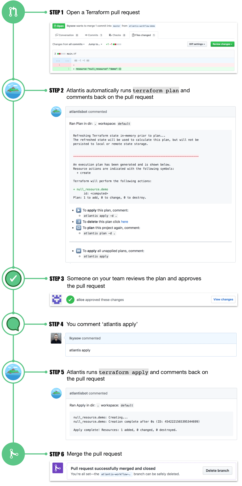

# Atlantis

## Terraform Pull Request Automation

- Atlantis is self-hosted. Your credentials don't leave your infrastructure.
- Runs as a Golang binary or Docker image and can be deployed on VMs, Kubernetes, Fargate, etc.
- Listens for webhooks from GitHub/GitLab/Bitbucket/Azure DevOps.
- Runs terraform commands remotely and comments back with their output.

- Each pull request now holds a detailed log of what infrastructure changes were made and when; along with who made the change and who approved it.
- Atlantis can be configured to require approvals on every production change.

- Developers can submit Terraform pull requests without needing credentials.
- Operators can require approvals prior to allowing an apply.

## Fewer Mistakes

- Catch errors in the Terraform plan output before it's applied.
- Ensure that you apply changes before merging to master.

## Atlantis Workflow

