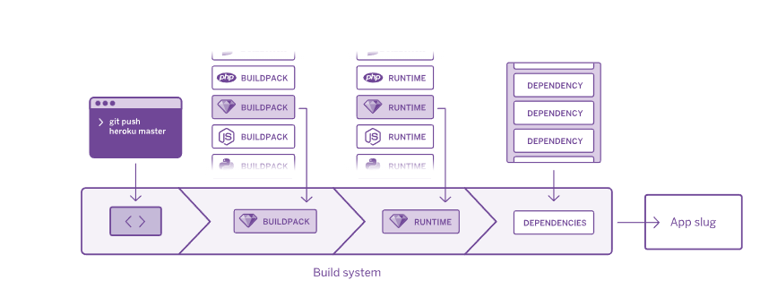

# Deploy in Heroku

Heroku's automated build system makes the build process seamless and fast for developers. To deploy an app, Heroku needs only three things from the developer: source code, a list of dependencies, and a "Procfile" (a text file that indicates which command should be used to start the code running). The build system takes the application, its dependencies, and the language runtime and produces a "slug". A slug contains everything needed to run the app, except for the operating system.

Heroku starts the app by deploying the slug to a dyno (or set of dynos) and invoking a command specified in the Procfile.

## Heroku Buildpacks

Heroku Buildpacks allow developers to extend Heroku’s build system to support other languages or customizations.

## Heroku Stack

The final component needed to run an application is the operating system. On Heroku, this is called the "stack"—an operating system image curated and maintained by Heroku. The stack is based on Ubuntu, the open source Linux distribution.